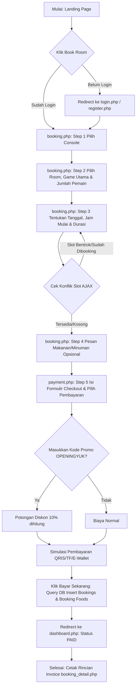

# app-rental-ps
Tugas kelompok untuk Pengembangan Web - **Rental PS Booking System**

Sistem reservasi online room rental console game (Nintendo Switch, PS4, PS5) berbasis web native PHP dan MySQL, dirancang dengan antarmuka bertema gaming modern (dark/neon violet, cyan, dan gold) serta layout yang sepenuhnya responsif.

---

## 📁 Struktur Folder Project

```text
app-rental-ps/
├── config/
│   └── database.php         # Koneksi database menggunakan PDO & Fitur Auto-Installer
├── database.sql             # Skema tabel database dan seeder data awal
├── assets/
│   ├── css/
│   │   └── style.css        # Desain CSS gaming & glassmorphism kustom
│   └── js/
│       └── script.js        # Validasi client-side, dynamic tab steps, & AJAX calls
├── ajax/
│   ├── check_slot.php       # Validasi bentrok ketersediaan waktu slot room (AJAX)
│   ├── get_games.php        # Ambil game berdasarkan console terpilih (AJAX)
│   ├── calculate_total.php  # Perhitungan nominal room, food, diskon, & total (AJAX)
│   └── save_session.php     # Menyimpan inputan form antar step secara asinkron ke session PHP
├── index.php                # Landing page utama
├── register.php             # Registrasi akun user baru
├── login.php                # Autentikasi login user umum & redirector
├── logout.php               # Hapus session & logout akun
├── dashboard.php            # Halaman utama user (riwayat pemesanan)
├── booking.php              # Aplikasi wizard booking (Step 1-4)
├── payment.php              # Halaman detail pembayaran (Step 5)
├── booking_detail.php       # Detail invoice ringkasan booking pasca bayar
└── admin/
    ├── login.php            # Autentikasi khusus administrator
    ├── logout.php           # Keluar dari akun admin
    ├── sidebar.php          # Komponen sidebar admin terpadu
    ├── dashboard.php        # Statistik & 5 transaksi terbaru admin
    ├── consoles.php         # Manajemen CRUD Console
    ├── rooms.php            # Manajemen CRUD Ruangan
    ├── games.php            # Manajemen CRUD Judul Game
    ├── foods.php            # Manajemen CRUD Menu Makanan & Minuman
    └── bookings.php         # Manajemen Daftar Booking Transaksi (Edit status/Hapus)
```

---

## 🛠️ Cara Menjalankan Project di XAMPP

Project ini dilengkapi fitur **Self-Healing Auto-Database Installer**. Anda tidak perlu melakukan import SQL manual melalui phpMyAdmin karena sistem akan mendeteksi database yang hilang dan membangunnya secara otomatis ketika halaman diakses pertama kali!

1. Pastikan aplikasi XAMPP terinstal di komputer Anda.
2. Salin (copy) seluruh folder `app-rental-ps` ke direktori web root XAMPP Anda:
   * **Windows**: `C:\xampp\htdocs\app-rental-ps\`
3. Jalankan Control Panel XAMPP, aktifkan layanan **Apache** dan **MySQL**.
4. Buka browser web Anda (Chrome, Edge, Firefox, dll).
5. Kunjungi alamat URL project berikut:
   * **`http://localhost/app-rental-ps/`**
6. Halaman utama akan muncul. Sistem secara otomatis membuat database `rental_ps` di latar belakang dan mengisi seeder data awal (3 console, 3 room, puluhan game, menu makanan, akun admin default, dan akun user default).

*(Catatan: Jika Anda tetap ingin mengimpor database secara manual, silakan buat database baru di phpMyAdmin bernama `rental_ps`, lalu impor file `database.sql` yang terletak di root folder).*

---

## 🔑 Akun Demo Default (Uji Coba)

Gunakan kredensial berikut untuk menguji sistem:

### 1. Akun User (Pelanggan)
* **Email**: `user@gmail.com`
* **Password**: `user123`
* **Hak Akses**: Melakukan booking room step-by-step, memesan makanan, membayar simulasi, melihat riwayat booking di dashboard, dan melihat invoice.

### 2. Akun Administrator (Pengelola)
* **Email**: `admin@gmail.com`
* **Password**: `admin123`
* **Hak Akses**: Mengakses dashboard statistik pendapatan, menambah/mengedit/menghapus master console, room, game, food, memperbarui status booking (Pending / Paid / Cancelled), dan menghapus transaksi booking.
* **Akses Portal**: Klik menu profil admin pasca login, atau langsung akses ke **`http://localhost/app-rental-ps/admin/`**.

---

## 🔄 Alur (Workflow) Booking Reservasi


